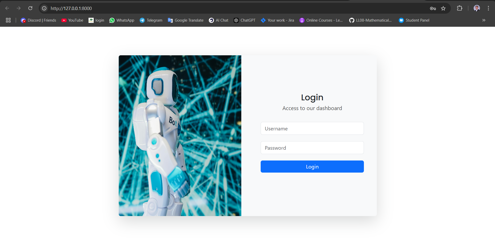
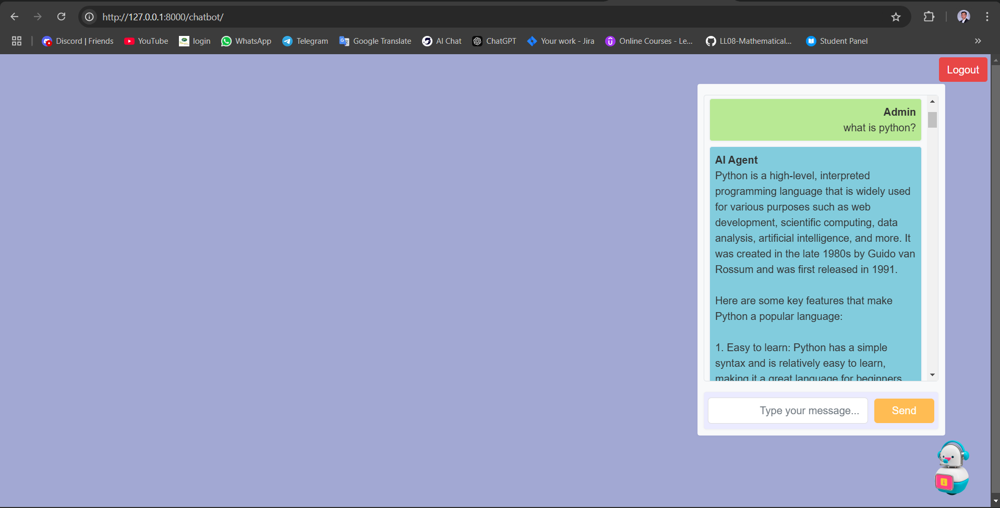
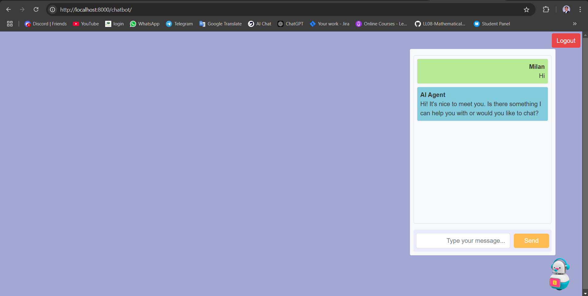
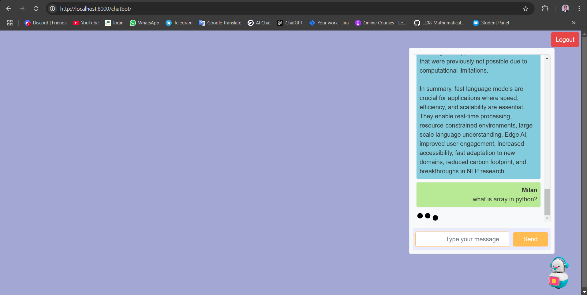

# Asynchronous Chatbot Application with Django, Celery, Redis, and Groq LLM API

## Objective
This project is a web-based chat application where users interact with a chatbot powered by Groq's Large Language Model (LLM) API. The application uses Django as the web framework, Celery for asynchronous task management, and Redis as the message broker and result backend. Together, these tools provide a seamless and responsive chat experience for users.


## Setup

### Prerequisites
1. **Python 3.10** or higher
2. **Redis Server**: Ensure Redis is installed and running.
3. **Django & Celery**: Install required packages from `requirements.txt`.

### OS
Use **WSL** (Windows Subsystem for Linux) or **Ubuntu** for setting up the development environment.

---

### 1. Environment Setup
1. Clone the repository and navigate to the project directory.

2. Create and activate a virtual environment:

   ```
   python3.10 -m venv env
   source env/bin/activate  
   env\Scripts\activate     
   ```
3. Install dependencies:

   ```
   pip install -r requirements.txt
   ```

### 2. Redis Setup
Install and start the Redis server (for Ubuntu users):

```
sudo apt-get install redis-server
sudo service redis-server start
```

### 3. Django Configuration
In your Django `settings.py`, configure Celery to use Redis as the message broker and result backend:

```python
CELERY_BROKER_URL = 'redis://localhost:6379/0'
CELERY_RESULT_BACKEND = 'redis://localhost:6379/0'
```

---

## Running the Application

To start both the Celery worker and the Django server, use the following commands:

```
celery -A chatbot_project worker --loglevel=info & python manage.py runserver
```

- This command will start the Celery worker in the background and run the Django development server.

- Access the application at `http://127.0.0.1:8000/`

---

## Login Credentials

The application includes sample login credentials for an admin and a standard user:

### Admin Login
- **Username:** `admin`
- **Password:** `admin`

### Standard User Login
- **Username:** `milan`
- **Password:** `Admin@123`

---

## Screenshots of the working application

### Login Page


### Admin Chat Interface


### User Chat Interface


### User Chat Live Loading Indicator


---